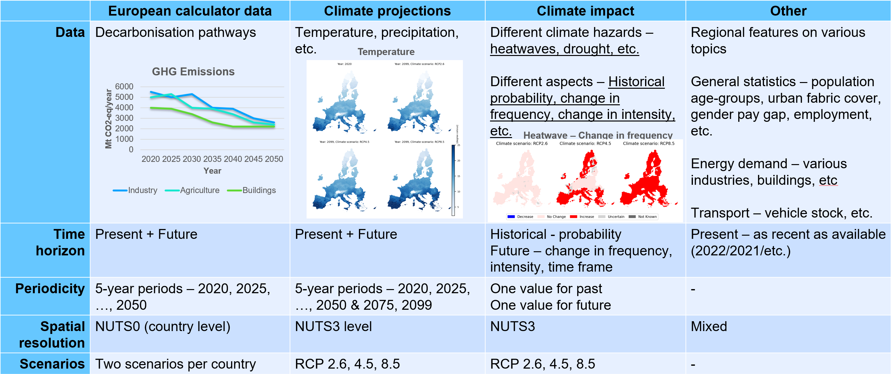

<!-- markdownlint-disable line-length no-inline-html -->
# LOCALISED Datasharing API Client: Client library for accessing the LOCALISED Data Sharing Platform.

## About
This repository is a part of the LOCALISED Data Sharing Platform and serves as an access point to the data stored in the database. 

### What? 
Four types of datasets can be found in the database:



- All the datasets are collected for the 27 EU Member States
- As seen in the table above, the datasets are collected at different spatial resolutions. All the datasets are spatially disaggregated to Local Administrative Units (LAU). Therefore, the datasets can be accessed at any desired spatial resolution. 
- The decarbonisation pathways are generated using the [European calculator model](https://www.european-calculator.eu/documentation/) 
- A full list of variables can be found in [variables_with_details_and_tags.xlsx](https://github.com/FZJ-IEK3-VSA/LOCALISED-Datasharing-API-Client/blob/develop/CoM_template_filling/data/input/variables_with_details_and_tags.xlsx) 

### Why? 
The goal of the LOCALISED project is to downscale decarbonisation trajectories consistent with the EU's net-zero targets to local levels, with the aim of supporting local authorities, businesses and citizens in understanding and undertaking mitigation and adaptation actions. In order to perform this downscaling, the project collected a large amount of data at different spatial levels. The LOCALISED project needs this data for its own actions but the resulting datasets are made public and easily available, through this API client. 

This data for both the present and future, at a very fine spatial resolution, is extremely useful for planners, researchers, and other interested parties.

## Getting started
The official API documentation can be found under http://data.localised-project.eu/dsp/docs/. Here, a step-by-step instructions to install the API client and access the example queries is detailed. 

### Installation 
1. Install miniforge, if not already installed. 

2. Clone the repository.
    ```bash
    git clone https://github.com/FZJ-IEK3-VSA/LOCALISED-Datasharing-API-Client.git
    ```

3. Install dependencies and the repo in a clean conda environment.
    ```bash
    cd LOCALISED-Datasharing-API-Client
    mamba env create -f requirements.yml 
    conda activate dsp_client
    pip install -e.
    ```

### Examples
Two Jupyter notebooks are prepared to showcase the API client capabilities:
1. [single_region_data.ipynb](https://github.com/FZJ-IEK3-VSA/LOCALISED-Datasharing-API-Client/blob/develop/examples/single_region_data.ipynb): It shows how the data for all the variables can be accessed for a single region, at any spatial level. 
2. [single_variable_data.ipynb](https://github.com/FZJ-IEK3-VSA/LOCALISED-Datasharing-API-Client/blob/develop/examples/single_variable_data.ipynb): It shows how the data a single variable can be accessed for all the regions, at any spatial level.   

Along with the datasets, the metadata relevant to the variables and the regions can be accessed. Please check out the Jupyter notebooks for more details. 

### Parameters
Depending on type of query, the list of required parameters change. Please refer to the doc strings of each funtion to get the entire list of relevant parameters. They would be a subset of the ones below:

- `version` --> The DSP version that you want to query. For example: "v1", "v2", etc. **DSP latest version - v5**

- `country_code` --> The country for which you wish to query the data. For example: "de", "es", "nl", etc

- `spatial_resolution` --> Options - NUTS0, NUTS1, NUTS2, NUTS3, LAU 

- `region_code` --> If you wish to filter on a particular region, provide a region code here. 
    Please note the following:
    - Region codes at NUTS0, follow the [EU country codes](https://ec.europa.eu/eurostat/statistics-explained/index.php?title=Glossary:Country_codes)
    - Region codes at NUTS1, NUTS2, and NUTS3 can be found on [Eurostat](https://ec.europa.eu/eurostat/de/web/nuts/local-administrative-units). 
        These codes are subject to change every 4 years. We follow NUTS 2016 codes. 
    - Region codes at LAU can be found on [Eurostat](https://ec.europa.eu/eurostat/de/web/nuts/local-administrative-units). 
        These codes are subject to change every year. We follow LAU2019 for all countries, except France and Italy. For these countries, LAU2018 is followed. 
        The `region_code` parameter takes LAU codes in the form "< NUTS3 > _ < LAU >". Therefore, please prepend the parent NUTS3 region and an "_" to a LAU code. 
        For example, LAU code of Eixen, Germany is "13073022". And its parent NUTS3 code is "DE80L". Therefore, `region_code` = "DE80L_13073022". 

        For a list of region codes, please query the region metadata. 
    
- `variable` --> If you wish to get data for a particular variable, provide the name here

- `pathway_description` --> If you wish to filter on a particular EUCalc decarbonisation pathway, provide the name here. Can be either "national" or "with_behavioural_changes"

- `climate_experiment` --> If you wish to filter on a particular climate experiment, provide the name here. Can be one of "RCP2.6", "RCP4.5", "RCP8.5", "Historical"

## Citations

**Manuscripts and datasets:**
- Patil, S., Pflugradt, N., Weinand, J. M., Stolten, D., & Kropp, J. (2024). A systematic review of spatial disaggregation methods for climate action planning. Energy and AI, 17, 100386.
- Patil, S., Pflugradt, N., Weinand, J. M., Kropp, J., & Stolten, D. (2025). Spatially Disaggregated Energy Consumption and Emissions in End-use Sectors for Germany and Spain (Version V1) [Data set]. Zenodo. https://doi.org/10.5281/zenodo.14097217

**Project deliverables:**
- Patil, S.; Vestraete, J.; Pflugradt, N. (2024), Data Sharing Platform Final Version (LOCALISED Deliverable 3.4)

- Patil, S.; Verstraete, J.; Pflugradt N. (2024), Disaggregation Methodology and Working Disaggregation Tool (LOCALISED Deliverable 3.1)
- Verstraete, J.; Patil, S.; Pflugradt N., Radziszewska W. (2023), Database for 3 EU countries with relevant data for the year 2020 (LOCALISED Deliverable 3.2)
- Verstraete, J.; Patil, S.; Pflugradt N., Radziszewska W. (2023), Database with all relevant data for the year 2020 (LOCALISED Deliverable 3.3).

- Patil, S.; Verstraete, J.; Pflugradt, N.; Seydeswitz, T.; Costa, L.; Radziszewska, W. (2023), Climate change database and other spatial data for 3 EU countries (LOCALISED Deliverable 2.4)
- Patil, S.; Verstraete, J.; Pflugradt, N.; Seydeswitz, T.; Radziszewska, W. (2023), Climate change database and other spatial data (LOCALISED Deliverable 2.5).

## About Us 
<a href="https://www.fz-juelich.de/en/ice/ice-2"></a>

We are the <a href="https://www.fz-juelich.de/en/ice/ice-2">Institute of Climate and Energy Systems (ICE) - Jülich Systems Analysis</a> belonging to the <a href="https://www.fz-juelich.de/en">Forschungszentrum Jülich</a>. Our interdisciplinary department's research is focusing on energy-related process and systems analyses. Data searches and system simulations are used to determine energy and mass balances, as well as to evaluate performance, emissions and costs of energy systems. The results are used for performing comparative assessment studies between the various systems. Our current priorities include the development of energy strategies, in accordance with the German Federal Government’s greenhouse gas reduction targets, by designing new infrastructures for sustainable and secure energy supply chains and by conducting cost analysis studies for integrating new technologies into future energy market frameworks.


## Acknowledgement
This work was developed as part of the project ["LOCALISED"](https://www.localised-project.eu/)—Localised decarbonization pathways for citizens, local administrations and businesses to inform for mitigation and adaptation action. This project received funding from the European Union’s Horizon 2020 research and innovation programme under grant agreement No. 101036458.

This work was also supported by the Helmholtz Association under the program ["Energy System Design"](https://www.helmholtz.de/en/research/research-fields/energy/energy-system-design/).